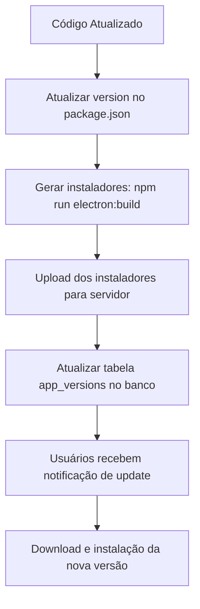

# Sistema de Atualizações Automáticas

## 🔄 Como Funciona

O Menu's Desktop agora possui um sistema de atualizações automáticas que:
- ✅ Verifica automaticamente se há nova versão disponível
- ✅ Exibe um botão de atualização na tela de login quando houver update
- ✅ Download e instalação simplificados para o usuário
- ✅ Controle de versões via banco de dados na nuvem

## 📋 Processo de Atualização

### 1. Quando você quiser lançar uma nova versão:

1. **Atualize a versão no package.json:**
   ```json
   {
     "version": "1.1.0"
   }
   ```

2. **Gere os instaladores:**
   ```bash
   npm run electron:build:win   # Para Windows
   npm run electron:build:mac   # Para Mac
   npm run electron:build:linux # Para Linux
   ```

3. **Faça upload dos instaladores para seu servidor:**
   - Os arquivos estarão em `dist-electron/`
   - Você pode hospedar em qualquer servidor web, S3, etc.
   - Exemplo de estrutura:
     ```
     https://seu-dominio.com/downloads/
       ├── Menu's-1.1.0-win.exe
       ├── Menu's-1.1.0-mac.dmg
       └── Menu's-1.1.0-linux.AppImage
     ```

4. **Atualize a tabela de versões no banco de dados:**
   - Acesse o backend do Lovable Cloud
   - Vá na tabela `app_versions`
   - Desmarque `is_current` da versão anterior
   - Insira uma nova linha:
     ```sql
     INSERT INTO app_versions (
       version,
       is_current,
       release_notes,
       download_url_windows,
       download_url_mac,
       download_url_linux
     ) VALUES (
       '1.1.0',
       true,
       'Nova versão com melhorias X, Y e Z',
       'https://seu-dominio.com/downloads/Menu-s-1.1.0-win.exe',
       'https://seu-dominio.com/downloads/Menu-s-1.1.0-mac.dmg',
       'https://seu-dominio.com/downloads/Menu-s-1.1.0-linux.AppImage'
     );
     ```

### 2. O que acontece para os usuários:

1. **Usuário abre o app desktop**
2. **App verifica automaticamente** se há nova versão via API
3. **Se houver atualização disponível:**
   - Um alerta aparece embaixo dos campos de login
   - Mostra a nova versão e as notas de lançamento
   - Botão "Atualizar" para baixar a nova versão
4. **Usuário clica em "Atualizar":**
   - Faz download do instalador apropriado
   - Executa o instalador
   - Versão atualizada substituirá a antiga

## 🔧 Configuração Técnica

### Versão Atual
Está definida em 3 lugares:
- `package.json` → `"version": "1.0.0"`
- `src/components/UpdateChecker.tsx` → `const CURRENT_VERSION = "1.0.0"`
- Banco de dados → tabela `app_versions`

### Auto-Update do Electron
- Usa `electron-updater` para gerenciar atualizações
- Configurado em `electron/main.js`
- Verifica automaticamente ao iniciar o app (apenas em produção)

### Componente de Verificação
- `src/components/UpdateChecker.tsx`
- Consulta a API para buscar versão mais recente
- Compara com versão local
- Exibe alerta quando há atualização disponível
- Só aparece na versão desktop (detecta `window.electronDB`)

## 📦 Estrutura de Dados

### Tabela `app_versions`
```sql
CREATE TABLE app_versions (
  id UUID PRIMARY KEY,
  version TEXT NOT NULL UNIQUE,
  release_notes TEXT,
  download_url_windows TEXT,
  download_url_mac TEXT,
  download_url_linux TEXT,
  is_current BOOLEAN DEFAULT false,
  created_at TIMESTAMP WITH TIME ZONE
);
```

### Exemplo de Registro
```json
{
  "version": "1.0.0",
  "is_current": true,
  "release_notes": "Versão inicial do Menu's Desktop",
  "download_url_windows": "https://...",
  "download_url_mac": "https://...",
  "download_url_linux": "https://..."
}
```

## 🚀 Workflow Completo de Release



## 📝 Checklist de Release

- [ ] Atualizar `version` no `package.json`
- [ ] Atualizar `CURRENT_VERSION` em `UpdateChecker.tsx`
- [ ] Gerar instaladores para todas plataformas
- [ ] Fazer upload dos instaladores
- [ ] Atualizar tabela `app_versions` no banco
- [ ] Testar download e instalação
- [ ] Comunicar aos usuários (se necessário)

## ⚠️ Notas Importantes

1. **Sempre mantenha as versões sincronizadas** entre package.json, código e banco
2. **Apenas uma versão** pode ter `is_current = true` por vez
3. **URLs devem ser públicas** e acessíveis sem autenticação
4. **Notas de lançamento** ajudam usuários a entenderem o que mudou
5. **Testagem** é essencial antes de marcar como versão atual
